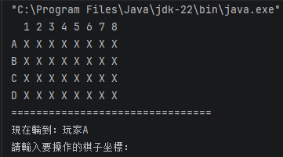
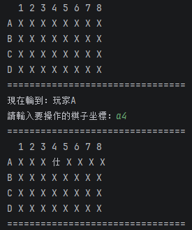
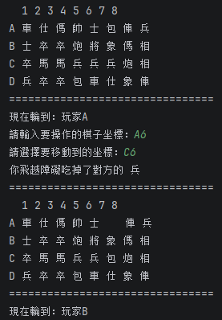

# H1 Report

* Name: 張以艦
* ID: D1177633

---

## 題目：象棋翻棋遊戲

## 設計方法概述
本次作業使用 Java 物件導向程式設計 (OOP) 實作終端機版的「暗棋」遊戲。系統主要分為四個核心類別，互相配合以完成遊戲運作：

1.  Chess (棋子模型)：封裝了單一棋子的屬性（名稱、權重、所屬陣營、是否翻開）。透過覆寫 toString() 方法，讓未翻開的棋子在畫面上顯示為「X」，翻開後則顯示真實名稱。


2.  Player (玩家模型)：記錄玩家名稱與所屬陣營（0代表未定，1代表紅方，2代表黑方）。


3.  AbstractGame (抽象遊戲介面)：定義了遊戲必須具備的基礎合約，如設定玩家 (setPlayers) 與判斷遊戲結束 (gameOver)。


4.  ChessGame (遊戲主引擎)：繼承自抽象類別，負責管控所有遊戲核心邏輯：
    -   棋盤初始化 (generateChess)：先以一維陣列 (pool) 建立 32 顆棋子並利用 Random 進行洗牌打亂，再依序填入 4x8 的二維陣列 (board) 中。

    -    畫面顯示 (showAllChess)：利用雙層迴圈走訪二維陣列，並加上 A~D 與 1~8 的座標軸，動態印出當前棋盤狀態。若該格棋子已被吃掉（值為 null），則以空白填充維持排版。

    -    輸入與座標轉換 (convertCoordinate)：將玩家輸入的直覺字串（如 "A2"），透過字元 ASCII 碼的減法運算，轉換為程式可讀的二維陣列索引 (row, col)。

    -    遊戲主迴圈 (startGame)：採用 while(!gameOver()) 不斷循環。內部實作了完整的互動邏輯，包含：翻棋、首翻定營（第一顆翻開的棋子決定玩家陣營）、合法步數判斷（上下左右移動一格）、一般吃子（比對 weight 大小）、特殊規則（兵剋帥、炮打隔子），以及透過 switchPlayer() 進行回合交替。

## 程式、執行畫面及其說明
### 棋盤初始化與視覺化顯示

說明： 
遊戲的核心是一個 4x8 的二維陣列。我們透過雙層迴圈走訪陣列，配合字串陣列印出 A~D 與 1~8 的座標軸。由於結合了物件導向中覆寫 toString() 的觀念，當棋子尚未翻開時會自動印出「X」，若該位置為空值 (null) 則印出空白，完美對齊排版。
```
public void showAllChess(){
    // ... (前略：印出 1~8 數字座標) ...
    String[] rowLetters = {"A", "B", "C", "D"};

    for (int i = 0; i < rowLetters.length; i++) {
        System.out.print(rowLetters[i] + " ");
        for (int j = 0; j < 8; j++) {
            if (board[i][j] == null){
                System.out.print("  "); // 空位印出空白維持排版
            } else {
                System.out.print(board[i][j]); // 依據翻開狀態印出 X 或棋子名稱
            }
            if (j < 7) System.out.print(" ");
        }
        System.out.println();
    }
}
```


### 座標轉換與翻棋互動邏輯
說明：
為了讓玩家能直覺地輸入座標（如 "A2"），我設計了 convertCoordinate 方法，利用 ASCII 碼字元相減的原理將字串轉換為二維陣列的索引 (row, col)。在主迴圈中，會根據玩家選取的座標進行翻棋，並在第一步時觸發「首翻定營」邏輯，決定雙方陣營並切換回合。
```
// 座標轉換器：將 "A2" 轉為 [0, 1]
public int[] convertCoordinate(String input){
    input = input.toUpperCase();
    int row = input.charAt(0) - 'A';
    int col = input.charAt(1) - '1';
    return new int[]{row, col};
}

// ... 在 startGame() 的翻棋邏輯 ...
if (!target.getIsRevealed()){
    target.setRevealed();
    // 首翻定營邏輯
    if (currentPlayer.getSide() == 0){
        currentPlayer.setSide(target.getSide());
        if (currentPlayer.getSide() == 1){
            p2.setSide(2);
        } else {
            p2.setSide(1);
        }
    }
    switchPlayer(); // 換人
}
```


### 特殊吃子規則
說明：
暗棋中最複雜的邏輯在於「炮/包」必須「隔一顆棋子」才能吃子。我實作了專屬的判斷分支，利用 ```Math.min``` 與 ```Math.max``` 找出起點與終點，並透過 for 迴圈精準計算兩點之間的障礙物數量 (count)。只有當中間剛好有一顆棋子時 (count == 1)，才允許進行跳吃。
```
// 炮/包 的跳吃邏輯判斷
} else if (target.getWeight() == 2) {
    if (row == destRow || col == destCol) {
        int count = 0;  // 障礙物計數器
        if (row == destRow) {
            int minCol = Math.min(col, destCol);
            int maxCol = Math.max(col, destCol);
            for (int i = minCol + 1; i < maxCol; i++) {
                if (board[row][i] != null) count++;
            }
        } 
        // ... (直向計算略) ...

        if (count == 1) {
            board[destRow][destCol] = target;
            board[row][col] = null;
            System.out.println("你飛越障礙吃掉了對方的 " + destPiece.getName());
            switchPlayer();
        } else {
            System.out.println("炮吃子中間必須剛好隔一顆棋子！請重新操作");
        }
    }
}
```


# AI 使用狀況與心得

我將 AI 當作專屬的程式導師，採用「階段式對話開發」來逐步完成遊戲。AI 協助我釐清了許多程式設計上的盲點：
1.  物件導向觀念的釐清（封裝與 Getter/Setter）： 在開發初期，我遇到無法在 ChessGame 存取 Chess 類別中 isRevealed 變數的報錯。我最初的解法是直接將變數改為 public，但 AI 糾正了我的做法，向我解釋了 OOP 中「封裝 (Encapsulation)」的重要性，並引導我撰寫 Getter 方法來讀取狀態，確保了物件資料的安全性。


2.  解決物件記憶體位置亂碼問題： 在實作印出「目前輪到：玩家A」時，畫面曾出現 ``org.example.Player@...`` 的亂碼。透過 AI 的解說，我才了解到這是因為沒有明確呼叫 getName() 或覆寫 toString()，導致 Java 預設印出了物件的記憶體位址，這加深了我對 Java 物件輸出的底層理解。


3.  邏輯除錯與 Fallthrough 效應： 在撰寫複雜的吃子規則時，我曾連續使用多個 if 判斷式，導致程式在判斷「兵吃帥」成功後，又繼續往下執行一般比大小的邏輯，造成吃子失敗。AI 協助我找出了這個「穿透效應 (Fallthrough)」Bug，並教導我使用 else if 鏈條來確保互斥條件的正確執行。


4.  複雜演算法指導（炮的特殊規則）： 實作「炮/包」的跳吃規則是本作最困難的部分。AI 提供了非常清晰的邏輯藍圖，教導我如何先判斷直線移動，再使用 ``Math.min`` 和 ``Math.max`` 找出起點與終點，最後利用 for 迴圈掃描路徑並計算「障礙物數量 (count)」，成功完美還原了炮必須「剛好隔一顆棋子」才能吃子的複雜規則。


最後在撰寫這份報告的時候我讓AI根據我與他的對話情況生成設計方法概述以及AI使用狀況與心得。


## 心得
這次的作業讓我對 Java 程式設計有了突破性的成長。以前寫程式可能只是單純把語法拼湊起來，但這次透過從零開始打造一款規則繁複的「暗棋遊戲」，我真正體會到了「系統架構設計」與「物件導向」的威力。將不同的功能與資料妥善拆分到 Player、Chess 和 ChessGame 中，讓原本龐大的遊戲邏輯變得清晰且易於維護。

在開發過程中，處理「二維陣列的走訪」以及撰寫「各式各樣的防呆機制與特例判斷（例如：兵吃帥、炮跳吃、不能吃自己人、不能斜著走）」是最燒腦但也最有趣的地方。當程式碼從一開始只能印出滿滿的「X」，到後來成功實作洗牌，最後能夠在終端機上流暢地兩人對弈並正確判定勝負時，那種看著程式碼「活過來」的成就感真的非常巨大。這次的經驗不但大幅提升了我拆解問題、邏輯思考的能力，也讓我學會了如何更有技巧地進行 Debug，收穫非常豐富。